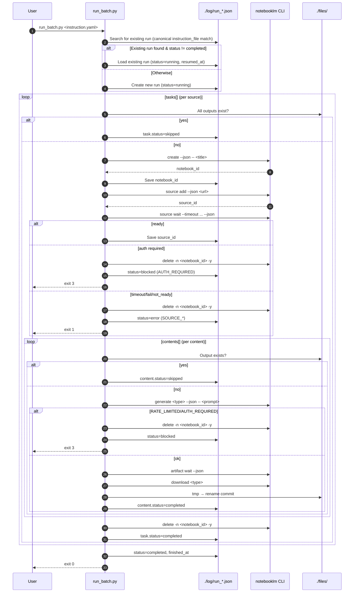
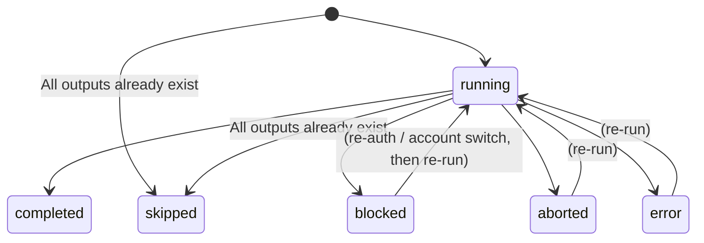

# NotebookLM Batch


A batch content generation tool that uses NotebookLM to automatically create podcasts, slides, reports, quizzes, and more from YouTube videos and website URLs.

[](LICENSE)

## TL;DR

### What it does
Batch-generates content from YouTube videos, web pages, and other sources using NotebookLM. Write a YAML instruction file, run it, and walk away.

### How it works
- Automatically creates a notebook per source → generates content → downloads → deletes the notebook
  - NotebookLM is used as a generation engine; no notebooks are left behind on the service
- **Output files are the source of truth**: if a file exists locally, it is skipped (supports rerun and resume)
- **Auto-resume**: re-running the same YAML resumes from where it left off
- **Idempotent**: same source → same output directory and filename (stable hashing)

### Let the AI do it all (Claude Code Skill)

The `.claude/skills/notebooklm-batch/` directory includes a **Claude Code Skill**.
With [Claude Code](https://claude.ai/code), you can skip writing YAML entirely — just say what you want:

> "Make a podcast from this YouTube video: https://..."

Claude will handle YAML creation, dry-run verification, and background execution automatically.

### Recommended use cases
- Batch-convert multiple YouTube videos into podcasts, slides, or reports
- Bulk-process news articles or tech blogs into reports or flashcards
- "Fire and forget" with background execution + GitHub Issue notifications

### Supported IN / OUT

| IN (source) | OUT (content) |
|-------------|---------------|
| YouTube URL | Podcast (MP3) |
| Website URL | Infographic (PNG) |
| Text file | Slide Deck (PDF) |
| Inline text | Video (MP4) |
| | Quiz (JSON) |
| | Flashcards (JSON) |
| | Report (Markdown) |
| | Data Table (CSV) |

---

## Requirements

- Python 3.11+
- [pipx](https://pipx.pypa.io/)
- A Google account with access to [NotebookLM](https://notebooklm.google.com/)

## Installation

See [INSTALL.md](INSTALL.md) for full setup instructions.

```bash
git clone https://github.com/KunihiroS/notebooklm-batch.git
cd notebooklm-batch
pip install -r requirements.txt
pipx install "notebooklm-py[browser]"
notebooklm login
```

## Quick Start

1. Create a YAML instruction file in `instructions/`:

```yaml
# instructions/my_task.yaml
settings:
  language: en

tasks:
  - source: "https://www.youtube.com/watch?v=YOUR_VIDEO_ID"
    title: "My Notebook"
    contents:
      - type: podcast
        prompt: "Summarize the video in an engaging podcast format."
```

2. Run a dry-run to verify:

```bash
python3 run_batch.py ./instructions/my_task.yaml --dry-run
```

3. Execute in the background:

```bash
nohup python3 run_batch.py ./instructions/my_task.yaml > log/nohup_output.log 2>&1 &
```

Generated files are saved to `./files/<title>__<hash>/`.

## Supported Sources

| Source | Example |
|--------|---------|
| YouTube URL | `https://www.youtube.com/watch?v=...` |
| Website URL | `https://example.com/article` |
| Text file | `./path/to/document.txt` |
| Inline text | Plain text string |

## Supported Output Types

| `type` | Output | Format |
|--------|--------|--------|
| `podcast` | Audio podcast | MP3 |
| `slide` | Slide deck | PDF |
| `image` | Infographic | PNG |
| `video` | Explainer video | MP4 |
| `report` | Written report | Markdown |
| `quiz` | Quiz questions | JSON |
| `flashcards` | Flashcards | JSON |
| `data-table` | Data table | CSV |

## Contributing

Contributions are welcome. Please open an issue or pull request on [GitHub](https://github.com/KunihiroS/notebooklm-batch).

---

# Directory Layout

```
notebooklm-batch/
├── README.md                   # This document
├── AGENTS.md                   # Operational guide for AI agents
├── run_batch.py                # Batch execution script
├── instructions/               # YAML instruction files
│   └── <any-name>.yaml
├── files/                      # Generated outputs
│   └── <safe_title>__<source_hash>/
│       ├── <type>_<hash>.png
│       ├── <type>_<hash>.mp3
│       └── ...
└── log/                        # Run logs and progress files
    └── run_YYYYMMDDHHmmss.json
```

| Directory / File | Description |
|------------------|-------------|
| `instructions/` | Where users place YAML instruction files |
| `files/` | Where generated outputs (images, audio, video, PDF) are saved |
| `log/` | Execution logs and progress JSON (used for auto-resume) |
| `run_batch.py` | Batch processing script |
| `AGENTS.md` | Operational guide for AI agents running the batch |

# Execution (Runbook)

Place a YAML instruction file under `./instructions/` and ask an AI agent (or run directly) to execute it with `run_batch.py`. Initial authentication requires browser-based login by the user.

- The AI follows `AGENTS.md` to execute processing based on the YAML file.
- The user can also ask the AI to create the instruction YAML itself.

### When asking an AI to create an instruction file

Items the AI will confirm with the user:

| Item | Required | Description | Example |
|------|----------|-------------|---------|
| **source** | ✅ | Target URL(s) (multiple allowed) | `https://www.youtube.com/watch?v=XXXXX` |
| **content type** | ✅ | What to generate | `podcast` / `image` / `slide` / `video` |
| **title** | Optional | Notebook name (required for non-YouTube sources) | `AI Weekly Digest` |
| **prompt** | Recommended | Generation instructions | `Summarize in a clear, engaging tone` |
| **options** | Optional | See "Options" section below | `format: deep-dive`, `length: long` |
| **language** | Optional | Default: `ja` | `en`, `ja` |

> If the user gives a brief request such as "make a podcast from this video", the AI will confirm the desired prompt.

Current behavior of `run_batch.py`:

- The notebook title on NotebookLM uses `tasks[].title` from the YAML as-is
- If `tasks[].title` is omitted, `video_id` is used as the title (YouTube only)
- No suffix is appended

# Instruction File Format

Instruction files are written in YAML.

- **Location**: `./instructions/`
- **Naming**: `<any-name>.yml` or `<any-name>.yaml`
  - e.g. `instruction.yaml`, `ai_digest_20260207.yaml`
  - Use a name that identifies the purpose or date

> Note: Instruction files are YAML (`.yml` / `.yaml`), not Markdown (`.md`).

## Basic Structure

```yaml
# NotebookLM batch instruction
settings:
  language: en                  # Output language
  notify:                       # GitHub Issue notification (omit to disable)
    github_issue: 1             # Issue number to post to

tasks:
  - source: "https://www.youtube.com/watch?v=XXXXX"
    title: "Notebook Title"
    contents:
      - type: podcast
        prompt: "Summarize the video in an engaging way."
        options:
          format: deep-dive
          length: default

      - type: image
        prompt: "Visually summarize the key points."
        options:
          orientation: landscape
          detail: standard

  - source: "https://example.com/article"
    title: "Article Summary"
    contents:
      - type: report
        prompt: "Summarize the key points of the article."
```

## Field Reference

### settings (global configuration)

| Field | Required | Default | Description |
|-------|----------|---------|-------------|
| `language` | No | `ja` | Language for generation (passed to `notebooklm generate --language`) |
| `notify` | No | *(disabled)* | GitHub Issue notification settings (see below) |

#### notify (GitHub Issue notification)

Posts batch progress, completion, and errors as comments on a GitHub Issue.
Omit to disable notification (default behavior).

```yaml
settings:
  notify:
    github_issue: 1                            # Issue number to post to (required)
    github_repo: "YourName/notebooklm-batch"   # Omit to auto-resolve from git origin
```

| Field | Required | Description |
|-------|----------|-------------|
| `github_issue` | Yes (when notify is used) | Target Issue number |
| `github_repo` | No | Target repository (`owner/repo`). Omit to auto-resolve via `gh` CLI from origin remote |

**Prerequisites**:
- `gh` CLI must be installed and authenticated (`gh auth status`)
- The target Issue must exist in the repository

**Notification events**:

| Icon | Timing | Example |
|------|--------|---------|
| 🔄 | Batch start | `🔄 Batch started: 3 tasks / 7 contents` |
| ⏭️ | Skipped (output already exists) | `⏭️ [1/3] image skipped (exists)` |
| 📦 | Content completed | `📦 [1/3] image generated` |
| 🚫 | RATE_LIMITED / AUTH_REQUIRED | `🚫 Stopped: RATE_LIMITED` |
| ❌ | Error | `❌ Error: GENERATE_FAILED` |
| ✅ | Batch completed | `✅ Done: NEW:3 SKIP:2 / 05:30 elapsed` |
| ⏹️ | Ctrl+C interrupted | `⏹️ Interrupted: 2/5 completed` |

**Note**: Notifications are best-effort. Notification failures do not affect batch processing.

> **Note on `language`**: corresponds to the `--language` option of the notebooklm CLI.
> - If not specified in YAML, `run_batch.py` defaults to `ja`
> - The CLI's own default is `en`, so specify `ja` explicitly or omit it (run_batch.py fills in `ja`)

### tasks[] (task definition)

| Field | Required | Description |
|-------|----------|-------------|
| `source` | Yes | Source (YouTube URL / Website URL / text file path / inline text) |
| `title` | Yes* | Notebook name on NotebookLM & base for output directory name. *YouTube URLs may omit (falls back to `video_id`) |
| `contents` | Yes (1+) | List of content to generate |

> **Backward compatibility**: the `url:` field still works but emits a warning. Use `source:` in new files.

### tasks[].contents[] (content definition)

| Field | Required | Description |
|-------|----------|-------------|
| `type` | Yes | `podcast` / `image` / `slide` / `video` / `quiz` / `flashcards` / `report` / `data-table` |
| `prompt` | No | Custom instructions for generation |
| `options` | No | Per-type options (see below) |

> Output filename is automatically determined as `<type>_<hash>.<ext>` (stable hash)

## Supported Content Types

| Type | CLI command | Output format | Key options |
|------|-------------|---------------|-------------|
| **Podcast** | `generate audio` | MP3 | format, length |
| **Infographic** | `generate infographic` | PNG | orientation, detail |
| **Slide Deck** | `generate slide-deck` | PDF | format, length |
| **Video** | `generate video` | MP4 | format, style |
| **Quiz** | `generate quiz` | JSON | quantity, difficulty, download_format |
| **Flashcards** | `generate flashcards` | JSON | quantity, difficulty, download_format |
| **Report** | `generate report` | Markdown | format |
| **Data Table** | `generate data-table` | CSV | *(none)* |

## Options

> When options are omitted, NotebookLM's defaults are used. Specifying options explicitly is recommended for predictable results.

### Audio (Podcast)

| Option | Values |
|--------|--------|
| `--format` | `deep-dive` / `brief` / `critique` / `debate` |
| `--length` | `short` / `default` / `long` |

### Infographic

| Option | Values |
|--------|--------|
| `--orientation` | `landscape` / `portrait` / `square` |
| `--detail` | `concise` / `standard` / `detailed` |

### Slide Deck

| Option | Values |
|--------|--------|
| `--format` | `detailed` / `presenter` |
| `--length` | `default` / `short` |
| `download_format` | `pdf` (default) / `pptx` (editable PowerPoint) |

### Video

| Option | Values |
|--------|--------|
| `--format` | `explainer` / `brief` |
| `--style` | `auto-select` / `classic` / `whiteboard` / `kawaii` / `anime` / `watercolor` / `retro-print` / `heritage` / `paper-craft` |

### Quiz

| Option | Values |
|--------|--------|
| `--quantity` | `fewer` / `standard` / `more` |
| `--difficulty` | `easy` / `medium` / `hard` |
| `download_format` | `json` / `markdown` / `html` (default: `json`) |

> Note: `--quantity more` is equivalent to `standard` internally (known limitation). `--language` is not supported. Changing `download_format` changes the output file extension accordingly (`markdown` → `.md`, `html` → `.html`).

### Flashcards

| Option | Values |
|--------|--------|
| `--quantity` | `fewer` / `standard` / `more` |
| `--difficulty` | `easy` / `medium` / `hard` |
| `download_format` | `json` / `markdown` / `html` (default: `json`) |

> Note: `--language` is not supported. Changing `download_format` changes the output file extension accordingly.

### Report

| Option | Values |
|--------|--------|
| `--format` | `briefing-doc` / `study-guide` / `blog-post` / `custom` |

> Note: Specifying a prompt automatically switches to `custom` format. Use `--append` to add custom instructions to an existing format (briefing-doc / study-guide / blog-post).

### Data Table

No generate options. **Prompt is required** (empty prompt causes a CLI error). Output is CSV (UTF-8-BOM).

## Example Instruction Files

### Minimal (YouTube, single content)

```yaml
tasks:
  - source: "https://www.youtube.com/watch?v=XXXXX"
    title: "Video Title"
    contents:
      - type: podcast
        prompt: "Summarize the video in an engaging way."
```

> `title` is optional for YouTube URLs only (falls back to `video_id`). `prompt` is also optional but recommended.

### Full (multiple sources, multiple content types)

```yaml
settings:
  language: en
  notify:
    github_issue: 1

tasks:
  - source: "https://www.youtube.com/watch?v=XXXXX"
    title: "AI Trends Digest"
    contents:
      - type: podcast
        prompt: "Cover the overall picture first, then dive into individual topics."
        options:
          format: deep-dive
          length: long
      - type: image
        prompt: "Summarize the 3 key points visually."
        options:
          orientation: portrait
          detail: concise
      - type: slide
        prompt: "Create a presentation suitable for internal sharing."
        options:
          format: presenter
          length: default

  - source: "https://example.com/tech-article"
    title: "Tech Article Summary"
    contents:
      - type: report
        prompt: "Summarize from a technology selection perspective."
        options:
          format: briefing-doc
      - type: quiz
        prompt: "Quiz on the key points of the article."
        options:
          quantity: standard
          difficulty: medium
      - type: data-table
        prompt: "Create a comparison table of the tools mentioned."
```

## Identifiers

- `run_id`
  - Identifier assigned to each batch execution
  - Format: `YYYYMMDDHHmmss` (e.g. `20260208200022`)
  - Used in: progress filename (`./log/run_<run_id>.json`) and temp file collision avoidance (`.__tmp__<run_id>`)
- `source_hash` (output directory name)
  - Output directory is automatically determined as `{safe_title}__{sha256(source)[:8]}`
  - Same `source` always maps to the same directory (idempotency)
- `type_<hash>` (filename)
  - Output filename is automatically determined as `<type>_<hash>.<ext>`
  - Hash is computed from `source/type/prompt/options` using a stable hash (same input → same filename)

## Design Principles

- The execution engine wraps the `notebooklm` CLI in Python, parsing `--json` output to update progress
- Resume/completion decisions are based on local output files, not NotebookLM server state
  - If `./files/<dir>/<type>_<hash>.<ext>` exists, that content is always skipped
  - Filenames are determined by **stable hashing** (`type_<hash>`)
    - e.g. `image_7f3a2c1b`
    - Hash is computed by JSON-serializing `url/type/prompt/options` (keys sorted) and taking the first 8 characters of SHA1
    - Purpose: resilient to YAML reordering, ensuring stable skip/resume behavior
- On `RATE_LIMITED` and similar failures, the content is recorded as `blocked`; re-running with a different account skips already-completed outputs
- Output filenames are deterministic and writes go through a temp file (`<type>_<hash>.<ext>.__tmp__<run_id>`) before a rename commit (resilient to interruption and parallelism)

## Operational Requirements (minimum)

- The user specifies one YAML file per execution (processing multiple YAMLs simultaneously is not supported)
  - A single YAML may contain multiple sources in `tasks[]`
- Invocation:
  - `python3 ./run_batch.py ./instructions/<INSTRUCTION>.yaml`
- **Dry-run mode** (pre-execution verification):
  - `python3 ./run_batch.py ./instructions/<INSTRUCTION>.yaml --dry-run`
  - Shows targets, output paths, and skip decisions without generating anything

## `run_batch.py` Operational Spec

- Base directory is the directory containing this README (and `run_batch.py`)
  - Outputs are saved under `./files/`
  - Progress is saved to `./log/run_YYYYMMDDHHmmss.json`
- Re-running the same YAML loads the most recent `run_*.json` and resumes from where it left off
  - Resume condition: `instruction_file` (canonical path) in `run_*.json` matches the canonical path of the specified YAML
    - Purpose: prevents resume failures due to path representation differences (e.g. `./instructions/x.yaml` vs `/abs/path/.../instructions/x.yaml`)
- Progress is displayed with a spinner and progress bar:
  ```
  ⠹ 🔄 [████████░░░░░░░░░░░░]  40% (2/5) | NEW:1 SKIP:1 | TIME:01:23 | LOG:run_20260211150030.json
  ```
  - Status icons: `🔄` running / `✅` completed / `🚫` blocked / `⏹️` aborted / `❌` error
  - `(2/5)` completed / total
  - `NEW:n` newly generated / `SKIP:n` skipped (file already exists)
  - `TIME:MM:SS` elapsed (switches to `HH:MM:SS` after one hour)
  - `LOG:run_*.json` progress filename
  - On block, reason is appended: `[AUTH_REQUIRED]` / `[RATE_LIMITED]`

  **Examples**:
  ```
  # Running
  ⠹ 🔄 [████████░░░░░░░░░░░░]  40% (2/5) | NEW:1 SKIP:1 | TIME:01:23 | LOG:run_xxx.json

  # Completed normally
    ✅ [████████████████████] 100% (5/5) | NEW:3 SKIP:2 | TIME:05:30 | LOG:run_xxx.json

  # All skipped (outputs already exist)
    ✅ [████████████████████] 100% (3/3) | NEW:0 SKIP:3 | TIME:00:04 | LOG:run_xxx.json

  # Blocked (auth error)
    🚫 [██████████░░░░░░░░░░]  50% (2/4) | NEW:1 SKIP:1 | TIME:02:15 | LOG:run_xxx.json [AUTH_REQUIRED]

  # Blocked (rate limit)
    🚫 [██████████████░░░░░░]  66% (2/3) | NEW:2 SKIP:0 | TIME:03:45 | LOG:run_xxx.json [RATE_LIMITED]
  ```
- Ctrl+C records `status=aborted` (next run auto-resumes)
- `RATE_LIMITED` / `AUTH_REQUIRED` records `status=blocked` and stops
- Exit codes:
  - `0`: completed
  - `3`: blocked
  - `130`: aborted (Ctrl+C)
  - `1`: error (source wait failure / generation failure / download failure)
  - `2`: usage error (YAML not found / invalid format)

### Implementation Status

This README is the authoritative specification. Divergences between the spec and implementation are recorded here.

- Target spec (this README):
  - `instruction_file` is stored and compared as a **canonical path** (`realpath` equivalent) for representation-agnostic auto-resume
  - Filenames are determined by **stable hashing** (`type_<hash>`) for resilience to reordering
- Current implementation (`run_batch.py`):
  - Both of the above are implemented (as of 2026-02-08)

### `run_batch.py` Detailed Spec

This section documents batch execution behavior as steps, states, and decision criteria so that README serves as the authoritative operational reference.

#### Glossary

- **Instruction**: the YAML file specified by the user (e.g. `./instructions/test_news.yaml`)
- **Task**: one element of `tasks[]` in the YAML (one source)
- **Content**: one element of `tasks[].contents[]` (`podcast` / `image` / `slide` / etc.)
- **Output**: `./files/<dir>/<type>_<hash>.<ext>`
- **Run state**: `./log/run_*.json`

#### Core Invariants (priority order)

1. **Output files are the source of truth** (for skip/resume decisions)
   - If an output file exists, that Content is always skipped (never regenerated)
2. **Notebooks are disposable** (aggressive deletion policy)
   - Notebooks are automatically deleted on task completion/failure/interruption
   - Re-runs always start fresh notebook creation (no `notebook_id`/`source_id` reuse)
3. **Never depend on NotebookLM server state** (minimize external dependency)

#### Filename Determination (Stable Hash)

Filenames are automatically determined as `<type>_<hash>.<ext>`.

- Hash = first 8 characters of SHA1 of `url/type/prompt/options` JSON-serialized (keys sorted)
- Same input always produces the same filename (deterministic)
- YAML reordering, addition, or deletion does not change filenames (stable skip/resume)

#### Auto-Resume (no `--resume` flag needed)

On re-running the same YAML, `run_batch.py` searches `log/run_*.json` for the **most recent file matching the same `instruction_file`** and resumes under these conditions:

- If that run is not `completed`:
  - Load the existing run, set `status=running` / `resumed_at`, and continue
- Otherwise:
  - Create a new `run_*.json` and start fresh

Note: `instruction_file` is stored and compared as a canonical path, so representation differences do not break auto-resume.

- Canonical path is resolved via Python's `Path.resolve()` (symlinks are resolved)

#### Execution Flow (sequential)

- Tasks are processed top to bottom
  - If all outputs already exist: skip the entire task (no notebook creation)
  - `notebooklm create --json -- <title>` creates the notebook
  - `notebooklm source add --json <url>` → `source wait` adds the source
- Contents are processed top to bottom
  - **(A) Output file exists**: `skipped`
  - **(B) Otherwise**: `generate` → identify `artifact_id` → `artifact wait` → `download` → `completed`
- Notebook is deleted at task end (success/failure/interruption)

#### Error and Stop Handling

- `AUTH_REQUIRED` (session expired) or `RATE_LIMITED` → **blocked**
  - Records `status=blocked` and `error` in progress, stops processing
  - After re-authentication (`notebooklm login`) or account switch, re-running the same YAML auto-resumes
- Ctrl+C → **aborted**
  - Records `status=aborted` and exits
  - Re-running the same YAML auto-resumes

- Non-Ctrl+C exits:
  - `SIGTERM` (e.g. terminal/app force-close, host shutdown) is also treated as **aborted** (`status=aborted`)
  - `SIGKILL` (e.g. `kill -9`) and power loss cannot be caught — `run_*.json` may remain with `status=running`
    - Even then, re-running the same YAML picks up the existing run and continues (output files are the truth; existing files are skipped)

- `source wait` failure (timeout/failure/not ready) or download failure → **error**
  - Records `status=error` and `error.code` in progress, exits (exit code 1)
  - Re-running restarts from notebook creation; already-completed outputs are skipped

#### Forcing Regeneration (bypassing skip)

If an output file already exists, re-running the same instruction file skips that content. To **regenerate with the same settings**:

| Method | Operation | Notes |
|--------|-----------|-------|
| **Back up the file** | `mv ./files/<dir>/<type>_<hash>.<ext> ./files/<dir>/<type>_<hash>.<ext>.bak` | Keeps the original for comparison |
| **Delete the file** | `rm ./files/<dir>/<type>_<hash>.<ext>` | Simple regeneration |
| **Back up the directory** | `mv ./files/<dir> ./files/<dir>_old` | Regenerates all content for that source |

**Note**: Changing `prompt` or `options` produces a different hash, creating a new file (the existing file remains).

```bash
# Example: force regeneration of an image
mv ./files/dQw4w9WgXcQ/image_a1b2c3d4.png ./files/dQw4w9WgXcQ/image_a1b2c3d4.png.bak

# Re-run (the image will be regenerated instead of skipped)
python3 run_batch.py ./instructions/my_instruction.yaml
```

#### Mermaid: Execution Flow



#### Mermaid: Run State Transitions



#### Status Values

| Level | Status | Description |
|-------|--------|-------------|
| run / task | `running` | In progress |
| run / task | `completed` | Completed successfully |
| run / task | `skipped` | Skipped because all outputs already exist |
| run / task | `blocked` | Stopped due to auth expiry / rate limit |
| run / task | `aborted` | Interrupted by Ctrl+C / SIGTERM |
| run / task | `error` | Processing failed (source wait / generate / download failure) |
| content | `pending` | Not yet processed |
| content | `running` | Being processed |
| content | `completed` | Completed successfully |
| content | `skipped` | Skipped because output file already exists |
| content | `blocked` | Auth expiry / rate limit |
| content | `error` | Processing failed |

### Operational Runbook

Minimum steps for the user to run "specify one YAML and execute."

#### 1. Initial / Re-authentication (only when needed)

If the session has expired or you want to run with a different account:

```bash
notebooklm login
```

- Log in to Google in the browser, press ENTER in the terminal once NotebookLM's home is visible

#### 2. Execute

Generation takes minutes to tens of minutes — **background execution is recommended**. Pair with `settings.notify` for "fire and forget → GitHub notification" UX.

```bash
# Background execution (recommended)
nohup python3 ./run_batch.py ./instructions/<INSTRUCTION>.yaml > log/nohup_output.log 2>&1 &

# Foreground execution (shows progress spinner, Ctrl+C to abort)
python3 ./run_batch.py ./instructions/<INSTRUCTION>.yaml
```

#### 3. Check results

- Progress file (run state): `./log/run_YYYYMMDDHHmmss.json`
- Outputs: `./files/<dir>/<type>_<hash>.<ext>`

#### 4. Interruption (Ctrl+C) and resume

- Press Ctrl+C to interrupt
  - `run_*.json` records `status=aborted`
- To resume, **re-run the same YAML**
  - The most recent `run_*.json` with a matching `instruction_file` (canonical path) is automatically loaded and processing continues

#### 5. Handling blocked status (AUTH_REQUIRED / RATE_LIMITED)

If `run_*.json` shows `status=blocked`, address the cause and re-run:

- `AUTH_REQUIRED`
  - `notebooklm login` to re-authenticate → re-run the same YAML
- `RATE_LIMITED`
  - Wait and retry, or switch to a different account
  - To switch accounts: back up the existing `storage_state.json`, then `notebooklm login`

#### 6. Skip behavior (output already exists)

On re-run, any `content` whose output file already exists is always `skipped`.

- Filenames are determined as `<type>_<hash>.<ext>`
- Same URL/type/prompt/options → same filename
- Changing the prompt produces a different filename (treated as a different output)

#### 7. settings.language

`settings.language` is a global setting only (per-content language override is not currently supported by `run_batch.py`).

#### 8. Concurrent execution

Do **not** run the same YAML with multiple processes simultaneously (no mutual exclusion is implemented).

#### 9. Temp files (during download)

- Progress JSON temp file: `run_*.json.tmp` (for atomic update)
- Output temp file: `<type>_<hash>.<ext>.__tmp__<run_id>` (renamed to final path after successful download)

Temp files may remain after interruption or abnormal exit. They are safe to delete (they are not final output files).

#### 10. Exit codes

- `0`: completed
- `3`: blocked
- `130`: aborted (Ctrl+C)

#### 11. Background execution (nohup)

Use `nohup` to run batch processing without occupying the terminal.
Combine with `settings.notify` for "fire and forget → GitHub notification" UX.

```bash
nohup python3 ./run_batch.py ./instructions/<INSTRUCTION>.yaml > log/nohup_output.log 2>&1 &
```

- `> log/nohup_output.log 2>&1` — redirect stdout and stderr to a log file
- Trailing `&` — run in background without blocking the shell
- Spinner output is recorded in the log file (use GitHub Issue notifications for progress monitoring)

Check and stop the process:

```bash
# Check if running
jobs            # within the same shell session
ps aux | grep run_batch  # from another terminal

# Stop
kill %1         # job number from jobs
kill <PID>      # PID from ps
```

> **Note:** Closing the terminal does not stop a `nohup` process. Shutting down the host machine does.

# Intended Workflow

1. **User creates an instruction file (YAML)**
   - List of sources (YouTube URLs, website URLs, etc.)
   - Per-source content types, options, and prompts
2. **AI reads the instruction file and runs the batch automatically**
   - Creates a new notebook on NotebookLM per source
   - Adds the source
   - Generates and saves the specified content sequentially
3. **AI reports results after processing**
   - Summary of results per source (success/failure)
   - Notebooks are automatically deleted after processing (nothing remains on NotebookLM)

# Operational Spec (YAML instruction workflow)

The user only needs to place an instruction YAML and request execution. The AI handles execution, progress management, and recovery.

## User responsibilities

- Place instruction files (`.yml` / `.yaml`) under `./instructions/`
- Request execution
- Complete browser-based `notebooklm login` authentication on first use

## AI responsibilities

- Read the instruction file and execute: create notebook → add source → generate → download → save per source
- Write execution logs to `./log/`
- Persist progress for long-running jobs and abnormal exits; on restart, auto-skip completed outputs and regenerate only remaining ones

## Execution model (sequential)

Sequential execution is used for stability.

- `tasks` are processed top to bottom
- `contents` within a task are also processed top to bottom

## Long-running jobs and recovery

Since notebooks are automatically deleted after processing, recovery after interruption is based on output file existence.
On re-run, notebook creation starts fresh, but Contents whose outputs already exist are automatically skipped.

> **Note**: YouTube source ingestion (transcription) is very fast (seconds to tens of seconds), so re-creation overhead is negligible.

### Progress persistence (minimum requirements)

Progress is saved under `./log/` per batch (= per instruction file execution).

- e.g. `./log/run_YYYYMMDDHHmmss.json`
- At minimum, the following are recorded per content generation:
  - `source`
  - `notebook_id`
  - `content type`
  - `output_path`
  - `artifact_id` (when available)

Since the same type may be generated multiple times within a notebook, recovery uses `artifact_id` rather than `type` alone (regenerate if unavailable).

#### Progress file example (run_YYYYMMDDHHmmss.json)

```json
{
  "run_id": "20260208200022",
  "instruction_file": "/abs/path/to/.../instructions/example.yaml",
  "started_at": "2026-02-08T20:00:22+09:00",
  "resumed_at": "2026-02-08T21:30:00+09:00",
  "status": "running",
  "tasks": [
    {
      "url": "https://www.youtube.com/watch?v=BDl3X9GqhVc",
      "video_id": "BDl3X9GqhVc",
      "title": "Test News",
      "notebook_id": "2ae0f4ee-0164-4ad4-b2aa-48ac7986a72b",
      "source_id": "ac317bde-4746-4e70-998f-e05a924a8163",
      "status": "running",
      "contents": [
        {
          "content_id": "image_7f3a2c1b",
          "type": "image",
          "prompt": "Visually summarize the key points.",
          "options": {
            "orientation": "landscape",
            "detail": "standard"
          },
          "task_id": "<generation job ID (obtained at generate time)>",
          "artifact_id": "<artifact ID (obtained after generation completes)>",
          "status": "running",
          "output_path": "files/BDl3X9GqhVc/image_7f3a2c1b.png",
          "error": null
        }
      ]
    }
  ],
  "finished_at": "<set when completed/blocked/aborted/error>"
}
```

#### Error object structure (on error)

```json
{
  "error": {
    "code": "GENERATE_FAILED",
    "at": "2026-02-08T20:15:30+09:00",
    "stdout": "<CLI stdout>",
    "stderr": "<CLI stderr>",
    "detail": { "<CLI JSON output if available>" }
  }
}
```

Common error codes: `CREATE_FAILED`, `SOURCE_ADD_FAILED`, `SOURCE_WAIT_FAILED`, `SOURCE_NOT_READY`, `GENERATE_FAILED`, `ARTIFACT_WAIT_FAILED`, `ARTIFACT_FAILED`, `ARTIFACT_NOT_FOUND`, `DOWNLOAD_FAILED`, `AUTH_REQUIRED`, `RATE_LIMITED`

Notes:

- `instruction_file` is stored and compared as a canonical path (equivalent to `realpath`)
- `resumed_at` is set only on resume runs
- `task_id` is stored only when available from `generate`
- `artifact_id` is stored only when available after generation (regenerate if unavailable)
- `content_id` is an internal identifier (auto-determined as `type_<hash>`)

### Status polling / waiting

- Wait for source ingestion to complete:
  - `notebooklm source wait <SOURCE_ID> --timeout <sec> [--json]`
- Check generation job status:
  - `notebooklm artifact poll <TASK_ID> -n <NOTEBOOK_ID>`
  - Note: `artifact poll` does not support `--json`
  - If `TASK_ID` is unavailable, use `artifact wait --json` after `artifact_id` is confirmed (`run_batch.py` saves `artifact_id` to progress)
- Wait for generation to complete (blocking):
  - `notebooklm artifact wait <ARTIFACT_ID> -n <NOTEBOOK_ID> --timeout <sec> --interval <sec> [--json]`
  - `run_batch.py` defaults to `--timeout 86400 --interval 5` (24-hour timeout, effectively unlimited)

Use `--json` with `generate` to get machine-readable output and reliably capture identifiers such as `artifact_id`.

## Cleanup (notebook deletion)

**Aggressive deletion policy**: notebooks are automatically deleted after processing (success/failure/interruption).
Manual notebook deletion is not normally required.

If a notebook remains for any reason, delete it from the Web UI or via CLI:

- e.g. `notebooklm delete -n <NOTEBOOK_ID> -y` (partial ID is accepted)

# notebooklm-py Usage Guide

Guide for automatically generating podcasts, images, slides, and videos from YouTube videos.

## Environment Setup (using pipx)

### Initial setup (once only)

```bash
# Install via pipx
pipx install "notebooklm-py[browser]"

# Install Playwright's Chromium
pipx run --spec "notebooklm-py[browser]" python -m playwright install chromium

# Initial authentication
notebooklm login
# → Browser opens for Google login → press ENTER to save

# Verify
notebooklm --version
```

Credentials are saved to `~/.notebooklm/storage_state.json`.

## Tips

- To try a different account, back up `~/.notebooklm/storage_state.json` and re-run `notebooklm login`
- If a notebook title starts with `-`, the CLI interprets it as an option — use `--` to separate it (e.g. `notebooklm create --json -- "-LpMZyDZI8k"`)
- Infographic (image) generation can take several minutes (source ingestion wait + generation and download)
- Generation may hit `RATE_LIMITED` (Google-side rate limiting). If recovery is difficult, consider re-logging in with a different account
- Running multiple test cycles can accumulate notebooks on NotebookLM; delete unneeded ones with `notebooklm delete -n <NOTEBOOK_ID> -y`

---

# Development History

## 2026-02-12

### GitHub Issue Notification Feature

**Background**: Batch processing takes a long time (image ~3 min, slide ~6 min, podcast/video 10+ min), blocking the terminal UX.

**Implementation**:
- Added `settings.notify` option (`github_issue`, `github_repo`)
- Posts GitHub Issue comments at each batch step to notify progress
- Notifications are best-effort (failures do not affect batch processing)
- Combines with `nohup` for "fire and forget → notification arrives" UX

**Notification events**: start, skip, content complete, RATE_LIMITED, AUTH_REQUIRED, error, batch complete, interrupted

### Issue #2: Output directory name customization

**Background**: Output directories were fixed to `video_id`, which was hard to read.

**Implementation**:
- Added `settings.output_dir_mode` option
- Three modes:
  - `video_id`: video_id only (default, backward compatible)
  - `title`: title only (readability focused)
  - `title_with_video_id`: title + video_id (recommended)
- `slugify()` function converts to filesystem-safe strings
- Handles Windows reserved names, unsafe characters, and length limits

**Output examples**:
```
video_id:              files/dQw4w9WgXcQ/
title:                 files/Rick_Astley_-_Never_Gonna_Give_You_Up/
title_with_video_id:   files/Rick_Astley_-_Never_Gonna_Give_You_Up__dQw4w9WgXcQ/
```

### Issue #1: Aggressive deletion policy

**Background**: Even when output files already existed, notebooks and sources were created on NotebookLM, causing large numbers of duplicate notebooks to accumulate during test runs.

**Decision**:
- Option A (keep notebooks and reuse): complex state management
- Option B (generate → download → delete): simple implementation, eliminates duplication problem → **adopted**

**Implementation**:
- Notebooks are automatically deleted on task completion/failure/interruption
- If all outputs already exist, skip notebook creation entirely
- Enforce "output files are the source of truth" principle (no dependency on NotebookLM server state)
- `try/finally` pattern prevents deletion leaks

**Accepted trade-offs**:
- Cannot inspect results in NotebookLM Web UI → deemed unnecessary
- Notebook creation on every regeneration → source addition is fast (seconds to tens of seconds), so acceptable
