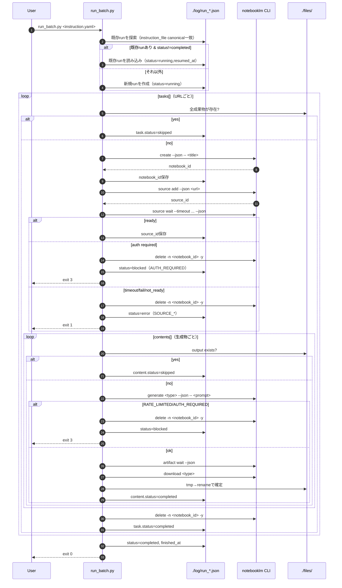
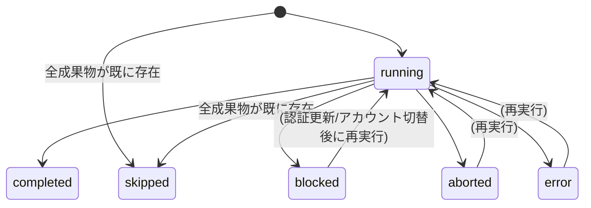

# NotebookLM Batch


A batch content generation tool that uses NotebookLM to automatically create podcasts, slides, reports, quizzes, and more from YouTube videos and website URLs.

[](LICENSE)

---

## Requirements

- Python 3.11+
- [pipx](https://pipx.pypa.io/)
- A Google account with access to [NotebookLM](https://notebooklm.google.com/)

## Installation

See [INSTALL.md](INSTALL.md) for full setup instructions.

```bash
git clone https://github.com/KunihiroS/notebooklm-batch.git
cd notebooklm-batch
pip install -r requirements.txt
pipx install "notebooklm-py[browser]"
notebooklm login
```

## Quick Start

1. Create a YAML instruction file in `instructions/`:

```yaml
# instructions/my_task.yaml
settings:
  language: ja

tasks:
  - source: "https://www.youtube.com/watch?v=YOUR_VIDEO_ID"
    title: "My Notebook"
    contents:
      - type: podcast
        prompt: "Summarize the video in an engaging podcast format."
```

2. Run a dry-run to verify:

```bash
python3 run_batch.py ./instructions/my_task.yaml --dry-run
```

3. Execute in the background:

```bash
nohup python3 run_batch.py ./instructions/my_task.yaml > log/nohup_output.log 2>&1 &
```

Generated files are saved to `./files/<title>__<hash>/`.

## Supported Sources

| Source | Example |
|--------|---------|
| YouTube URL | `https://www.youtube.com/watch?v=...` |
| Website URL | `https://example.com/article` |
| Text file | `./path/to/document.txt` |
| Inline text | Plain text string |

## Supported Output Types

| `type` | Output | Format |
|--------|--------|--------|
| `podcast` | Audio podcast | MP3 |
| `slide` | Slide deck | PDF |
| `image` | Infographic | PNG |
| `video` | Explainer video | MP4 |
| `report` | Written report | Markdown |
| `quiz` | Quiz questions | JSON |
| `flashcards` | Flashcards | JSON |
| `data-table` | Data table | CSV |

## Contributing

Contributions are welcome. Please open an issue or pull request on [GitHub](https://github.com/KunihiroS/notebooklm-batch).

---

## TL;DR

### What it is
YouTube動画・Webページ等の複数ソースから、NotebookLMを使ってコンテンツを**バッチ自動生成**するツール。YAML指示書を書いて実行するだけ。

### 仕組みと特徴
- ソースごとにノートブックを自動作成 → コンテンツ生成 → ダウンロード → ノートブック自動削除
  - ノートブックをサービス側に残さずサービスを生成エンジンとして扱います。
- **成果物ファイルが正**: ローカルにファイルがあればスキップ（再実行・リジューム対応）
- **自動リジューム**: 同じYAMLで再実行すると未完了分から自動再開
- **冪等性**: 同じソース → 同じ出力ディレクトリ・ファイル名（安定ハッシュ方式）

### お薦めのユースケース
- YouTube動画を複数まとめてPodcast/スライド/レポートに変換
- ニュース記事・技術ブログを一括でレポート/フラッシュカード化
- バックグラウンド実行 + GitHub通知で「投げて放置」運用

### 対応 IN / OUT

| IN（ソース） | OUT（コンテンツ） |
|-------------|-----------------|
| YouTube URL | Podcast（MP3） |
| Website URL | Infographic（PNG） |
| テキストファイル | Slide Deck（PDF/PPTX） |
| インラインテキスト | Video（MP4） |
| | Quiz（JSON/MD/HTML） |
| | Flashcards（JSON/MD/HTML） |
| | Report（Markdown） |
| | Data Table（CSV） |

---

# ディレクトリ構成

```
notebooklm-batch/
├── README.md                   # 本ドキュメント
├── AGENTS.md                   # AI向け実行指示書
├── run_batch.py                # バッチ実行スクリプト
├── instructions/               # 指示書YAML配置ディレクトリ
│   └── <任意の名前>.yaml
├── files/                      # 生成物
│   └── <safe_title>__<source_hash>/       # 例: AI最新動向まとめ__7f3a2c1b/
│       ├── <type>_<hash>.png              # 例: image_a1b2c3d4.png
│       ├── <type>_<hash>.mp3              # 例: podcast_e5f6g7h8.mp3
│       └── ...
└── log/                        # 実行ログ・進捗ファイル
    └── run_YYYYMMDDHHmmss.json # 進捗（再開用）
```

| ディレクトリ/ファイル | 説明 |
|----------------------|------|
| `instructions/` | ユーザーが作成する YAML 指示書の配置先 |
| `files/` | 生成された成果物（画像・音声・動画・PDF）の保存先 |
| `log/` | 実行ログと進捗 JSON（自動再開に使用） |
| `run_batch.py` | バッチ処理の実行スクリプト |
| `AGENT.md` | AI がバッチ処理を実行する際の指示書 |

# 実行（Runbook）

ユーザーは、`./instructions/` に指定フォーマットでYAML指示書を配置し、同YAMLを指定して実行をAIに指示する（初回認証はユーザーによるブラウザ操作が必要）。
- AIは `./AGENT.md` に従い、ユーザーが指定したYAML指示書を元に処理を `run_batch.py` で実行する。
- ユーザーは指示書YAMLの作成自体をAIに指示してもよい。

### 指示書作成をAIに委託する場合

AIがユーザーに確認する事項:

| 項目 | 必須 | 説明 | 例 |
|------|------|------|------|
| **YouTube URL** | ✅ | 処理対象の動画URL（複数可） | `https://www.youtube.com/watch?v=XXXXX` |
| **コンテンツ種類** | ✅ | 生成したいコンテンツ | `podcast` / `image` / `slide` / `video` |
| **ノートブック名** | 任意 | NotebookLM上の名前（省略時はvideo_id） | `AI最新動向まとめ` |
| **プロンプト** | 推奨 | 生成時の指示（省略可但非推奨） | `日本語で楽しく解説して` |
| **オプション** | 任意 | README.md「オプション一覧」参照 | `format: deep-dive`, `length: long` |
| **言語設定** | 任意 | デフォルト `ja` | `en`, `ja` |

> ユーザーが「この動画でポッドキャスト作って」のように簡潔に依頼した場合、AIはプロンプトの希望を確認する。

現行仕様（`run_batch.py` の挙動）:

- NotebookLM上のノートブックタイトルはYAML指示書の`tasks[].title` をそのまま使用する
- `tasks[].title` が未指定の場合は `video_id` をタイトルとして使用する
- suffix 付与はしない

# 指示書フォーマット

指示書は YAML 形式で記述する。

- **保存先**: `./instructions/`
- **命名規則**: `<任意の名前>.yml` または `<任意の名前>.yaml`
  - 例: `instruction.yaml`, `gasg_ai_20260207.yaml`
  - 用途や日付で識別できる名前を推奨

> 注意: 指示書は Markdown（`.md`）ではなく YAML（`.yml` / `.yaml`）として管理する。

## 基本構造

```yaml
# NotebookLM バッチ処理指示書
settings:
  language: ja                  # デフォルト言語
  notify:                       # GitHub Issue 通知（省略で無効）
    github_issue: 1             # 通知先の Issue 番号

tasks:
  - source: "https://www.youtube.com/watch?v=XXXXX"   # YouTube URL
    title: "ノートブック名"     # 出力先: files/ノートブック名__<hash>/
    contents:
      - type: podcast
        prompt: "日本語で楽しく解説して"
        options:
          format: deep-dive
          length: default

      - type: image
        prompt: "全体の要約を視覚的にまとめて"
        options:
          orientation: landscape
          detail: standard

  - source: "https://example.com/article"             # Website URL
    title: "記事タイトル"
    contents:
      - type: report
        prompt: "要点を日本語でまとめて"
```

## フィールド仕様

### settings（グローバル設定）

| フィールド | 必須 | デフォルト | 説明 |
|-----------|------|-----------|------|
| `language` | No | `ja` | 生成時の言語指定（`notebooklm generate --language` に渡される） |
| `notify` | No | *(無効)* | GitHub Issue 通知設定（下記参照） |

#### notify（GitHub Issue 通知）

バッチ処理の進捗・完了・エラーを GitHub Issue へのコメントとして通知します。
省略した場合、通知機能は無効です（従来通りの動作）。

```yaml
settings:
  notify:
    github_issue: 1                            # 通知先の Issue 番号（必須）
    github_repo: "YourName/notebooklm-batch"   # 省略時は gh が origin から自動解決
```

| フィールド | 必須 | 説明 |
|-----------|------|------|
| `github_issue` | Yes（notify 使用時） | 通知先の Issue 番号 |
| `github_repo` | No | 対象リポジトリ（`owner/repo` 形式）。省略時は `gh` CLI が origin リモートから自動解決 |

**前提条件**:
- `gh` CLI がインストール済み・認証済みであること（`gh auth status` で確認）
- 通知先の Issue が対象リポジトリに存在すること

**通知タイミング**:

| アイコン | タイミング | 例 |
|---------|-----------|-----|
| 🔄 | バッチ開始 | `🔄 バッチ開始: 3タスク / 7コンテンツ` |
| ⏭️ | スキップ（成果物が既存） | `⏭️ [1/3] image スキップ（既存）` |
| 📦 | コンテンツ1件完了 | `📦 [1/3] image 生成完了` |
| 🚫 | RATE_LIMITED / AUTH_REQUIRED | `🚫 RATE_LIMITED で停止` |
| ❌ | エラー | `❌ エラー: GENERATE_FAILED` |
| ✅ | バッチ全体完了 | `✅ 完了: NEW:3 SKIP:2 / 05:30経過` |
| ⏹️ | Ctrl+C 中断 | `⏹️ 中断: 2/5件完了` |

**注意**: 通知は best-effort です。通知の送信に失敗してもバッチ処理自体は影響を受けません。

> **補足**: `language` は notebooklm CLI の `--language` オプションに対応しています。
> - YAML で未指定の場合、`run_batch.py` は `ja` をデフォルトとして使用します
> - CLI 自体のデフォルトは `en` のため、日本語で生成したい場合は明示的に `ja` を指定するか、省略してください（`run_batch.py` が `ja` を補完）

### tasks[].（タスク定義）

| フィールド | 必須 | 説明 |
|-----------|------|------|
| `source` | Yes | ソース（YouTube URL / Website URL / テキストファイルパス等） |
| `title` | Yes* | NotebookLM上のノートブック名 & 出力ディレクトリ名のベース。*YouTube URLのみ省略可（省略時は`video_id`にフォールバック） |
| `contents` | Yes（1以上） | 生成するコンテンツのリスト |

> **後方互換**: `url:` フィールドも引き続き動作しますが、警告が出ます。新規指示書では `source:` を使用してください。

### tasks[].contents[].（コンテンツ定義）

| フィールド | 必須 | 説明 |
|-----------|------|------|
| `type` | Yes | `podcast` / `image` / `slide` / `video` / `quiz` / `flashcards` / `report` / `data-table` |
| `prompt` | No | 生成時のカスタムインストラクション |
| `options` | No | コンテンツタイプ別のオプション（後述） |

> 出力ファイル名は `<type>_<hash>.<ext>` 形式で自動決定される（安定ハッシュ方式）

## 生成可能なコンテンツ

| タイプ | CLI コマンド | 出力形式 | 主なオプション |
|--------|-------------|----------|----------------|
| **Podcast** | `generate audio` | MP3 | format, length |
| **Infographic（画像）** | `generate infographic` | PNG | orientation, detail |
| **Slide Deck（スライド）** | `generate slide-deck` | PDF | format, length |
| **Video（動画）** | `generate video` | MP4 | format, style |
| **Quiz（クイズ）** | `generate quiz` | JSON | quantity, difficulty, download_format |
| **Flashcards（フラッシュカード）** | `generate flashcards` | JSON | quantity, difficulty, download_format |
| **Report（レポート）** | `generate report` | Markdown | format |
| **Data Table（データテーブル）** | `generate data-table` | CSV | *(なし)* |

## オプション一覧
> オプションを指定しない場合、NotebookLMのデフォルト値が使用される。その挙動は正確には把握していないのでなるべくオプションを指定することを推奨する。

### Audio (Podcast)

| オプション | 値 |
|-----------|-----|
| `--format` | `deep-dive` / `brief` / `critique` / `debate` |
| `--length` | `short` / `default` / `long` |

### Infographic（画像）

| オプション | 値 |
|-----------|-----|
| `--orientation` | `landscape` / `portrait` / `square` |
| `--detail` | `concise` / `standard` / `detailed` |

### Slide Deck（スライド）

| オプション | 値 |
|-----------|-----|
| `--format` | `detailed` / `presenter` |
| `--length` | `default` / `short` |
| `download_format` | `pdf`（デフォルト）/ `pptx`（編集可能な PowerPoint 形式） |

### Video（動画）

| オプション | 値 |
|-----------|-----|
| `--format` | `explainer` / `brief` |
| `--style` | `auto-select` / `classic` / `whiteboard` / `kawaii` / `anime` / `watercolor` / `retro-print` / `heritage` / `paper-craft` |

### Quiz（クイズ）

| オプション | 値 |
|-----------|-----|
| `--quantity` | `fewer` / `standard` / `more` |
| `--difficulty` | `easy` / `medium` / `hard` |
| `download_format` | `json` / `markdown` / `html`（download時の出力形式、デフォルト: `json`） |

> 注意: `--quantity more` は API 内部では `standard` と同義（既知の制限）。`--language` は非対応。`download_format` を変更すると出力ファイルの拡張子もそれに合わせて変わる（`markdown` → `.md`、`html` → `.html`）。

### Flashcards（フラッシュカード）

| オプション | 値 |
|-----------|-----|
| `--quantity` | `fewer` / `standard` / `more` |
| `--difficulty` | `easy` / `medium` / `hard` |
| `download_format` | `json` / `markdown` / `html`（download時の出力形式、デフォルト: `json`） |

> 注意: `--language` は非対応。`download_format` を変更すると出力ファイルの拡張子もそれに合わせて変わる。

### Report（レポート）

| オプション | 値 |
|-----------|-----|
| `--format` | `briefing-doc` / `study-guide` / `blog-post` / `custom` |

> 注意: prompt を指定すると自動的に `custom` フォーマットに切り替わる。`--append` オプションで既存フォーマット（briefing-doc/study-guide/blog-post）にカスタム指示を追記できる。

### Data Table（データテーブル）

generate オプションなし。**prompt が必須**（空文字だと CLI エラー）。出力は CSV（UTF-8-BOM）。

## 指示書の例

### 最小構成（YouTube・1コンテンツ）

```yaml
tasks:
  - source: "https://www.youtube.com/watch?v=XXXXX"
    title: "動画タイトル"
    contents:
      - type: podcast
        prompt: "日本語で楽しく解説して"
```

> `title` はYouTube URLの場合のみ省略可（`video_id` にフォールバック）。`prompt` も省略可だが指定を推奨。

### フル構成（複数ソース・複数コンテンツ）

```yaml
settings:
  language: ja
  notify:
    github_issue: 1

tasks:
  - source: "https://www.youtube.com/watch?v=XXXXX"
    title: "AI最新動向まとめ"   # 出力先: files/AI最新動向まとめ__<hash>/
    contents:
      - type: podcast
        prompt: "カジュアルなトーンで楽しく解説して"
        options:
          format: deep-dive
          length: long
      - type: image
        prompt: "主要ポイントを3つに絞って図解"
        options:
          orientation: portrait
          detail: concise
      - type: slide
        prompt: "社内共有用のプレゼン資料として"
        options:
          format: presenter
          length: default

  - source: "https://example.com/tech-article"   # Website URL
    title: "技術記事まとめ"     # 出力先: files/技術記事まとめ__<hash>/
    contents:
      - type: report
        prompt: "技術選定の観点でまとめて"
        options:
          format: briefing-doc
      - type: quiz
        prompt: "記事の重要ポイントを出題"
        options:
          quantity: standard
          difficulty: medium
      - type: data-table
        prompt: "紹介されたツールの比較表を作成して"
```
## 識別子（用語）

- `run_id`
  - 1回のバッチ実行に付与される識別子
  - 形式: `YYYYMMDDHHmmss`（例: `20260208200022`）
  - 使い道: 進捗ファイル名（`./log/run_<run_id>.json`）や、一時ファイルの衝突回避（`.__tmp__<run_id>`）
- `source_hash`（出力ディレクトリ名）
  - 出力ディレクトリ名は `{safe_title}__{sha256(source)[:8]}` 形式で自動決定される
  - 同じ `source` なら常に同じディレクトリ（冪等性保証）
- `type_<hash>`（ファイル名）
  - 生成物ファイル名は `<type>_<hash>.<ext>` 形式で自動決定される
  - hash は `source/type/prompt/options` から安定ハッシュで計算（同じ入力なら同じファイル名）

## 設計原則

- 実行器は Python で CLI（`notebooklm`）をラップし、`--json` 出力をパースして進捗を更新する
- 再開・完了判定は NotebookLM 側ではなく、ローカル成果物ファイルを正とする
  - `./files/<video_id>/<type>_<hash>.<ext>` が存在する場合、その `content` は常にスキップする
  - ファイル名は **安定ハッシュ方式**（`type_<hash>`）で自動決定する
    - 例: `image_7f3a2c1b`
    - hash は `url/type/prompt/options` を **JSON化（キーを辞書順にソート）**して計算する
    - 目的: YAMLの並び順変更に強くし、スキップ/再開の安定性を上げる
- `RATE_LIMITED` 等で生成に失敗した場合は `blocked` として記録し、別アカウントで再実行しても成果物スキップで吸収できる設計にする
- 出力ファイル名は決定論的に固定し、書き込みは一時ファイル（例: `<type>_<hash>.<ext>.__tmp__<run_id>`）を経由してから rename で確定する（中断/並列に強い）

## 運用要件（最小）

- ユーザーは実行対象のYAMLファイルを 1つ 指定して実行を依頼する（複数YAMLの同時処理は想定しない）
  - 1つのYAML内に複数URL（`tasks[]`）が含まれるのは許容する
- 起動方法:
  - `python3 ./run_batch.py ./instructions/<INSTRUCTION>.yaml`
    > もしくは python ./run_batch.py ./instructions/<INSTRUCTION>.yaml
- **dry-run モード**（実行前の確認）:
  - `python3 ./run_batch.py ./instructions/<INSTRUCTION>.yaml --dry-run`
  - 実際の生成は行わず、処理対象と出力先、スキップ判定を確認できる

## `run_batch.py` の運用仕様

- パスの基準ディレクトリはこのREADMEのあるディレクトリ（スクリプトのあるディレクトリ）
  - 成果物は `./files/` 配下に保存される
  - 進捗は `./log/run_YYYYMMDDHHmmss.json` に保存される
- 同一YAMLを再実行した場合、直近の `run_*.json` が存在すれば自動で読み込み、途中から再開する
  - 自動再開の条件は `run_*.json` 内の `instruction_file`（canonical path）が、今回指定したYAMLのcanonical pathと一致すること
    - 目的: `./instructions/x.yaml` と `/abs/path/to/.../instructions/x.yaml` のような表記ゆれで再開できない事故をなくす
- 実行中はプログレスバー付きのスピナーで進捗を表示する
  ```
  ⠹ 🔄 [████████░░░░░░░░░░░░]  40% (2/5) | NEW:1 SKIP:1 | TIME:01:23 | LOG:run_20260211150030.json
  ```
  - ステータスアイコン: `🔄` 実行中 / `✅` 完了 / `🚫` blocked / `⏹️` aborted / `❌` error
  - `(2/5)` 完了数 / 全タスク数
  - `NEW:n` 新規生成した数 / `SKIP:n` スキップした数（既存ファイルあり）
  - `TIME:MM:SS` 経過時間（1時間以上は `HH:MM:SS` 形式）
  - `LOG:run_*.json` 進捗ファイル名
  - ブロック時は末尾に理由を表示: `[AUTH_REQUIRED]` / `[RATE_LIMITED]`

  **表示例**:
  ```
  # 実行中
  ⠹ 🔄 [████████░░░░░░░░░░░░]  40% (2/5) | NEW:1 SKIP:1 | TIME:01:23 | LOG:run_xxx.json

  # 正常完了
    ✅ [████████████████████] 100% (5/5) | NEW:3 SKIP:2 | TIME:05:30 | LOG:run_xxx.json

  # すべてスキップ（既存ファイルあり）
    ✅ [████████████████████] 100% (3/3) | NEW:0 SKIP:3 | TIME:00:04 | LOG:run_xxx.json

  # ブロック（認証エラー）
    🚫 [██████████░░░░░░░░░░]  50% (2/4) | NEW:1 SKIP:1 | TIME:02:15 | LOG:run_xxx.json [AUTH_REQUIRED]

  # ブロック（レートリミット）
    🚫 [██████████████░░░░░░]  66% (2/3) | NEW:2 SKIP:0 | TIME:03:45 | LOG:run_xxx.json [RATE_LIMITED]
  ```
- Ctrl+C で中断した場合は `status=aborted` を記録する（次回は自動再開される）
- `RATE_LIMITED` / `AUTH_REQUIRED` 等の実行不能は `status=blocked` を記録して停止する
- 終了コード（目安）:
  - `0`: completed
  - `3`: blocked
  - `130`: aborted（Ctrl+C）
  - `1`: error（ソース待機失敗/生成失敗/ダウンロード失敗など）
  - `2`: usage error（YAMLが見つからない/形式不正など）

### 実装状況（READMEとコードの整合性）

このREADMEは運用判断の根拠となるため、**目標仕様**と**現行実装**の差分はここに集約する。

- 目標仕様（READMEの方針）
  - `instruction_file` は **canonical path**（`realpath` 相当）で保存・比較する（表記ゆれに依存しない自動再開）
  - ファイル名は **安定ハッシュ**（`type_<hash>`）で自動決定する（順序変更に強い）
- 現行実装（`run_batch.py`）
  - 上記は実装に反映済み（2026-02-08）

### `run_batch.py` 詳細仕様

この節は「READMEを正」として運用判断できるように、バッチ実行の挙動を手順・状態・判定基準として言語化したもの。
（現行実装が未追従の箇所は上の「実装状況」に差分として明記する。）

#### 用語

- **Instruction**: ユーザーが指定するYAML（例: `./instructions/test_news.yaml`）
- **Task**: YAMLの `tasks[]` の1要素（基本的にYouTube URL単位）
- **Content**: `tasks[].contents[]` の1要素（`podcast` / `image` / `slide` / `video` / `quiz` / `flashcards` / `report` / `data-table`）
- **成果物（output）**: `./files/<video_id>/<type>_<hash>.<ext>`
- **進捗（run state）**: `./log/run_*.json`

#### 仕様の核（優先順位）

1. **成果物ファイルが正**（再開・完了判定）
   - 成果物が存在すれば、そのContentは常にスキップされる（再生成しない）
2. **ノートブックは使い捨て**（アグレッシブ削除方針）
   - タスク完了/失敗/中断のいずれでも、ノートブックは自動的に削除される
   - 再実行時は常に新規ノートブック作成から開始（`notebook_id`/`source_id`の引き継ぎなし）
3. **NotebookLM側の同名ノートや状態には依存しない**（= 依存を減らす）

#### ファイル名の決定（安定ハッシュ）

ファイル名は `<type>_<hash>.<ext>` 形式で自動決定される。

- hash は `url/type/prompt/options` を JSON化（キーを辞書順ソート）して SHA1 の先頭8文字を使用
- 同じ入力なら常に同じファイル名になる（決定論的）
- YAMLの並び替え・追加・削除でファイル名が変わらない（スキップ/再開が安定）

#### 自動リジューム（`--resume` 引数なし）

同じYAMLを再実行したとき、`log/run_*.json` の中から **同一 `instruction_file` を持つ最新のファイル**を探し、以下の条件でリジュームする。

- その run が `completed` ではない場合
  - 既存 run を読み込み、`status=running` / `resumed_at` を付与して続行
- それ以外
  - 新しい `run_*.json` を作成して実行

注意: `instruction_file` は canonical path として保存・比較するため、表記ゆれに依存しない自動再開が可能。

- canonical path は Python の `Path.resolve()` 相当で解決する（シンボリックリンクは解決される）

#### 実行フロー（逐次）

- Taskを上から順に処理
  - 全成果物が存在する場合はタスクごとスキップ（ノートブック作成なし）
  - `notebooklm create --json -- <title>` でノートブック作成
  - `notebooklm source add --json <url>`→`source wait` でソース追加
- Contentを上から順に処理
  - **(A) 成果物ファイルが存在**: `skipped`
  - **(B) それ以外**: `generate`→`artifact_id` 特定→`artifact wait`→`download`→`completed`
- タスク終了時（成功/失敗/中断問わず）にノートブックを削除

#### エラー・停止の扱い

- `AUTH_REQUIRED`（認証切れ）や `RATE_LIMITED` は **blocked**
  - 進捗に `status=blocked` と `error` を記録し、処理を停止する
  - 認証更新（`notebooklm login`）やアカウント切替後、同じYAMLで再実行すると自動リジュームされる
- Ctrl+C は **aborted**
  - `status=aborted` を記録して終了
  - 次回同じYAMLで再実行すると自動リジュームされる

- Ctrl+C 以外の終了（準正常/異常）
  - `SIGTERM`（例: ターミナル/アプリの強制終了、ホストのシャットダウン等）も **aborted** として扱う（`status=aborted` を記録）
  - `SIGKILL`（例: `kill -9`）や電源断/カーネルパニック等は捕捉できないため、`run_*.json` の `status` が `running` のまま残ることがある
    - その場合でも、同じYAMLで再実行すると既存runを拾って続行する（成果物ファイルが正、既存ファイルはスキップ）

- `source wait` の失敗（タイムアウト/失敗/readyにならない等）や、download失敗等は **error**
  - `run_*.json` に `status=error` と `error.code` を記録して終了する（exit code 1）
  - 再実行時はノートブック作成からやり直し、既に成果物が存在するContentはスキップされる

#### 意図的な再生成（スキップの回避）

成果物ファイルが既に存在する場合、同じ指示書を再実行してもそのコンテンツはスキップされる。
生成結果が期待と異なるなどの理由で**同じ設定のまま再生成したい**場合は、以下のいずれかの方法で対応する。

| 方法 | 操作 | 備考 |
|------|------|------|
| **ファイルを退避** | `mv ./files/<video_id>/<type>_<hash>.<ext> ./files/<video_id>/<type>_<hash>.<ext>.bak` | 元ファイルを保持したまま再生成。比較検証に便利 |
| **ファイルを削除** | `rm ./files/<video_id>/<type>_<hash>.<ext>` | 単純に再生成したい場合 |
| **ディレクトリごと退避** | `mv ./files/<video_id> ./files/<video_id>_old` | 当該動画の全コンテンツを再生成したい場合 |

**注意**: `prompt` や `options` を変更すると、ハッシュが変わり別ファイルとして生成される（既存ファイルは残る）。

```
# 例: image を再生成したい場合
mv ./files/dQw4w9WgXcQ/image_a1b2c3d4.png ./files/dQw4w9WgXcQ/image_a1b2c3d4.png.bak

# 再実行（スキップされずに再生成される）
python run_batch.py ./instructions/my_instruction.yaml
```

#### Mermaid: 処理フロー



#### Mermaid: run state（概念的な状態遷移）



#### ステータス値一覧

| レベル | ステータス | 説明 |
|--------|-----------|------|
| run / task | `running` | 実行中 |
| run / task | `completed` | 正常完了 |
| run / task | `skipped` | 全成果物が既に存在するためスキップ |
| run / task | `blocked` | 認証切れ/レート制限で停止 |
| run / task | `aborted` | Ctrl+C / SIGTERM で中断 |
| run / task | `error` | 処理失敗（ソース待機失敗/生成失敗/ダウンロード失敗等） |
| content | `pending` | 未処理 |
| content | `running` | 処理中 |
| content | `completed` | 正常完了 |
| content | `skipped` | 成果物ファイルが既に存在するためスキップ |
| content | `blocked` | 認証切れ/レート制限 |
| content | `error` | 処理失敗 |

### 実運用手順（Runbook）

このRunbookは、ユーザーが「指示書YAMLを1つ指定して実行」できるための最小手順。

#### 1. 初回/再認証（必要なときだけ）

認証が切れている場合や、別アカウントで実行したい場合は以下。

```bash
notebooklm login
```

- ブラウザでGoogleログインし、NotebookLMのホームが見えたらENTER

#### 2. 実行

生成には数分〜十数分かかるため、**バックグラウンド実行を推奨**。`settings.notify` と組み合わせることで「投げて放置 → GitHub 通知が来る」UX になる。

```bash
# バックグラウンド実行（推奨）
nohup python3 ./run_batch.py ./instructions/<INSTRUCTION>.yaml > log/nohup_output.log 2>&1 &

# フォアグラウンド実行（スピナーで進捗表示、Ctrl+C で中断可能）
python3 ./run_batch.py ./instructions/<INSTRUCTION>.yaml
```

#### 3. 結果の確認

- 進捗ファイル（run state）
  - `./log/run_YYYYMMDDHHmmss.json`
- 成果物
  - `./files/<video_id>/<type>_<hash>.<ext>`

#### 4. 中断（Ctrl+C）と再開

- 実行を中断したい場合は Ctrl+C
  - `run_*.json` に `status=aborted` が記録される
- 再開したい場合は **同じYAMLを再実行**する
  - `instruction_file`（canonical path）が一致する最新の `run_*.json` を自動で読み込み、途中から再開する

#### 5. blocked（AUTH_REQUIRED / RATE_LIMITED）時の対応

`run_*.json` が `status=blocked` になった場合は、原因に応じて対応してから再実行する。

- `AUTH_REQUIRED`
  - `notebooklm login` で再認証→同じYAMLで再実行
- `RATE_LIMITED`
  - 時間をおいて再実行するか、別アカウントへ切り替えて実行する
  - 別アカウントへ切替する場合は、既存の `storage_state.json` を退避してから `notebooklm login`

#### 6. スキップ（成果物が存在する場合）

再実行時は、成果物ファイルが既に存在する `content` は常に `skipped` になる。

- ファイル名は `<type>_<hash>.<ext>` 形式で自動決定される
- 同じ URL/type/prompt/options なら同じファイル名になる
- プロンプトを変えるとファイル名が変わる（別の成果物として扱われる）

#### 7. settings.language（言語設定）

`settings.language` はグローバル設定のみ（現行 `run_batch.py` は `contents` 単位での language 上書きは未対応）。

#### 8. 同時実行（複数プロセス）について

同一YAMLを **複数プロセスで同時実行しない**（排他制御は未実装）。

#### 9. 一時ファイル（ダウンロード中の.tmp）

- 進捗JSONの一時ファイル: `run_*.json.tmp`（atomic更新のため）
- 成果物の一時ファイル: `<type>_<hash>.<ext>.__tmp__<run_id>`（ダウンロード成功後にrenameで確定）

中断や異常終了で一時ファイルが残ることがある。
残骸は基本的に安全に削除できる（成果物ファイルではないため）。

#### 10. 終了コード（目安）

- `0`: completed
- `3`: blocked
- `130`: aborted（Ctrl+C）

#### 11. バックグラウンド実行（nohup）

ターミナルを占有せずにバッチ処理を実行したい場合は `nohup` を使う。
`settings.notify` と組み合わせることで「投げて放置 → GitHub 通知が来る」UX を実現できる。

```bash
nohup python3 ./run_batch.py ./instructions/<INSTRUCTION>.yaml > log/nohup_output.log 2>&1 &
```

- `> log/nohup_output.log 2>&1` — 標準出力・標準エラーをログファイルへリダイレクト
- 末尾の `&` — シェルをブロックせずバックグラウンドで実行
- スピナー等のターミナル出力はログファイルに記録される（進捗確認は GitHub Issue 通知を推奨）

プロセスの確認・停止:

```bash
# 実行中か確認
jobs            # 同一シェルセッション内
ps aux | grep run_batch  # 別ターミナルから

# 停止したい場合
kill %1         # jobs で表示されたジョブ番号を指定
kill <PID>      # ps で表示された PID を指定
```

> **Note:** `nohup` 実行時はターミナルを閉じてもプロセスは継続する。ただしホストマシン自体をシャットダウンするとプロセスは終了する。

# 想定ワークフロー

1. **ユーザーが「指示書」（YAMLファイル）を作成する**
   - 処理対象のYouTube URL一覧
   - 各URLに対する生成コンテンツの種類・オプション・プロンプト
2. **AIが指示書を読み込み、バッチ処理を自動実行する**
   - URLごとにNotebookLM上にノートブックを新規作成
   - YouTubeソースを追加
   - 指定されたコンテンツを順次生成・保存
3. **処理完了後、結果を報告する**
   - 各URLの処理結果（成功/失敗）をサマリ出力
   - ノートブックは処理完了後に自動削除される（NotebookLM上に残らない）

# 運用仕様（YAML指示書運用）

ユーザーは指示書（YAML）を配置して実行を依頼するだけとし、実行・進捗管理・復旧はAI側で完結させる。

## ユーザーの責務

- `./instructions/` 配下に指示書（`.yml` / `.yaml`）を配置する
- 実行を依頼する
- 初回のみ `notebooklm login` のブラウザ認証が必要

## AIの責務

- 指示書を読み込み、URLごとにノートブック作成→ソース追加→生成→ダウンロード→保存を実行する
- 実行ログを `./log/` に出力する
- 長時間処理/異常終了に備え、進捗を永続化し、再起動後に成果物ファイルの存在で自動スキップし未完了分のみ再生成できるようにする

## 実行モデル（逐次）

初期は安定性を優先して逐次実行とする。

- `tasks` は上から順に処理する
- 1つの `task` 内の `contents` も上から順に処理する

## 長時間処理と復旧（再起動復帰）

ノートブックは処理完了後に自動削除されるため、中断後の復旧は「成果物ファイルの存在」でスキップ判定される。
再実行時はノートブック作成からやり直しとなるが、既に成果物が存在するContentは自動スキップされる。

> **注意**: YouTubeソースの取り込み（文字起こし）は非常に速い（数秒〜十数秒）ため、再生成のコストは軽微。

### 進捗の永続化（最小要件）

1バッチ（= 1指示書の実行）ごとに、進捗を `./log/` 配下に保存する。

- 例: `./log/run_YYYYMMDDHHmmss.json`
- 各 `contents` 生成ごとに最低限以下を記録する
  - `video_id`
  - `notebook_id`
  - `content type`
  - `output_path`
  - `artifact_id`（取得できる場合）

同一ノートブック内で同一 `type` の生成が複数回走る可能性があるため、復旧・回収は `type` だけで特定せず `artifact_id` を用いる（取得できない場合は再生成する）。

#### 進捗ファイル例（run_YYYYMMDDHHmmss.json）

```json
{
  "run_id": "20260208200022",
  "instruction_file": "/abs/path/to/.../instructions/example.yaml",
  "started_at": "2026-02-08T20:00:22+09:00",
  "resumed_at": "2026-02-08T21:30:00+09:00",
  "status": "running",
  "tasks": [
    {
      "url": "https://www.youtube.com/watch?v=BDl3X9GqhVc",
      "video_id": "BDl3X9GqhVc",
      "title": "テストニュース",
      "notebook_id": "2ae0f4ee-0164-4ad4-b2aa-48ac7986a72b",
      "source_id": "ac317bde-4746-4e70-998f-e05a924a8163",
      "status": "running",
      "contents": [
        {
          "content_id": "image_7f3a2c1b",
          "type": "image",
          "prompt": "全体の要約を視覚的にまとめて",
          "options": {
            "orientation": "landscape",
            "detail": "standard"
          },
          "task_id": "<生成ジョブID（generate 実行時に取得）>",
          "artifact_id": "<成果物ID（生成完了後に取得）>",
          "status": "running",
          "output_path": "files/BDl3X9GqhVc/image_7f3a2c1b.png",
          "error": null
        }
      ]
    }
  ],
  "finished_at": "<set when completed/blocked/aborted/error>"
}
```

#### error オブジェクト構造（エラー発生時）

```json
{
  "error": {
    "code": "GENERATE_FAILED",
    "at": "2026-02-08T20:15:30+09:00",
    "stdout": "<CLI の標準出力>",
    "stderr": "<CLI の標準エラー出力>",
    "detail": { "<CLI の JSON 出力（あれば）>" }
  }
}
```

主なエラーコード: `CREATE_FAILED`, `SOURCE_ADD_FAILED`, `SOURCE_WAIT_FAILED`, `SOURCE_NOT_READY`, `GENERATE_FAILED`, `ARTIFACT_WAIT_FAILED`, `ARTIFACT_FAILED`, `ARTIFACT_NOT_FOUND`, `DOWNLOAD_FAILED`, `AUTH_REQUIRED`, `RATE_LIMITED`

メモ:

- `instruction_file` は canonical path（`realpath` 相当）で保存し、再開時も canonical 同士で比較する
- `resumed_at` はリジューム実行時にのみ設定される
- `task_id` は `generate` 実行時に取得できる場合のみ保存する
- `artifact_id` は生成完了後に取得できる場合のみ保存する（取得できない場合は再生成する）
- `content_id` は内部用識別子（`type_<hash>` 形式で自動決定）

### ステータス確認（ポーリング/待機）

- ソース取り込みの完了待ち:
  - `notebooklm source wait <SOURCE_ID> --timeout <sec> [--json]`
- 生成ジョブの状況確認:
  - `notebooklm artifact poll <TASK_ID> -n <NOTEBOOK_ID>`
  - メモ: `artifact poll` は `--json` をサポートしない前提で扱う
  - `TASK_ID` が手元にない場合は、`artifact_id` が確定してから `artifact wait --json` を使う（`run_batch.py` は `artifact_id` を進捗に保存する方針）
- 生成完了待ち（ブロッキング）:
  - `notebooklm artifact wait <ARTIFACT_ID> -n <NOTEBOOK_ID> --timeout <sec> --interval <sec> [--json]`
  - `run_batch.py` はデフォルトで `--timeout 86400 --interval 5` を使用（24時間タイムアウト、実質無制限）

生成（`generate`）は `--json` を使って機械可読な出力を記録し、`artifact_id` 等の識別子を確実に保存できるようにする。

## クリーンアップ（ノートブック削除）

**アグレッシブ削除方針**: ノートブックは処理完了後（成功/失敗/中断問わず）に自動削除される。
そのため、通常運用では手動でのノートブック削除は不要。

何らかの理由でノートブックが残った場合は、Web UI から削除するか、CLIで削除できる。

- 例: `notebooklm delete -n <NOTEBOOK_ID> -y`（部分ID指定が可能）

# notebooklm-py 使用ガイド

YouTube動画からPodcast、画像、スライド、動画を自動生成するためのガイド。

## 環境セットアップ（pipx使用）

### 初回セットアップ（一度だけ）

```bash
# pipx で一時的にインストールして認証を実行
pipx install "notebooklm-py[browser]"

# Playwright の Chromium をインストール（pipx 仮想環境内の Python から実行）
~/.local/share/pipx/venvs/notebooklm-py/bin/python -m playwright install chromium

# 初回認証
notebooklm login
# → ブラウザが開くのでGoogleログイン → ENTERで保存

# 確認
notebooklm --version
```

認証情報は `~/.notebooklm/storage_state.json` に保存されます。

## Tips

- 別アカウントで試したい場合は `~/.notebooklm/storage_state.json` を退避してから `notebooklm login` をやり直す
- Notebookタイトルが `-` で始まる場合、CLIがオプションとして解釈するため `--` を挟む（例: `notebooklm create --json -- "-LpMZyDZI8k"`）
- Infographic（image）の処理は数分かかることがある（Source追加後の待機 + 生成〜ダウンロードで数分）
- 生成は `RATE_LIMITED`（Google側のレート制限）になることがある。回復が難しい場合は、別アカウントでの再ログインを検討する
- PoCを複数回回すと NotebookLM 上にノートブックが多数作成される。不要になったものは `notebooklm delete -n <NOTEBOOK_ID> -y` で削除可能

---

# 開発履歴

## 2026-02-12

### GitHub Issue 通知機能

**背景**: バッチ処理が長時間かかり（画像3分、スライド6分、Podcast/動画10分超）、ターミナルがロックされるUX課題があった

**実装内容**:
- `settings.notify` オプションを追加（`github_issue`, `github_repo`）
- バッチ処理の各ステップで GitHub Issue にコメントを投稿し、進捗を通知
- 通知は best-effort（失敗してもバッチ処理に影響しない）
- `nohup` と組み合わせて「投げて放置 → 通知が来る」UX を実現

**通知ポイント**: 開始、スキップ、コンテンツ完了、RATE_LIMITED、AUTH_REQUIRED、エラー、全体完了、中断

### Issue #2: 出力ディレクトリ名のカスタマイズ機能

**背景**: 出力先ディレクトリが `video_id` 固定で可読性が低かった

**実装内容**:
- `settings.output_dir_mode` オプションを追加
- 3つのモードをサポート:
  - `video_id`: video_id のみ（デフォルト、後方互換）
  - `title`: タイトルのみ（可読性重視）
  - `title_with_video_id`: タイトル＋video_id（推奨）
- `slugify()` 関数でファイルシステム安全な文字列に変換
- Windows予約名、危険文字、長さ制限に対応

**出力例**:
```
video_id:           files/dQw4w9WgXcQ/
title:              files/Rick_Astley_-_Never_Gonna_Give_You_Up/
title_with_video_id: files/Rick_Astley_-_Never_Gonna_Give_You_Up__dQw4w9WgXcQ/
```

### Issue #1: アグレッシブ削除方針の採用

**背景**: 出力ファイルが既に存在する場合でも、NotebookLM上にノートブックとソースが作成され、テスト実行で大量の重複ノートブックが蓄積していた

**検討結果**:
- 選択肢A（ノートを残して再利用）: 状態管理が複雑
- 選択肢B（生成→DL→削除）: 実装シンプル、重複問題が消える → **採用**

**実装内容**:
- タスク完了/失敗/中断のいずれでも、ノートブックを自動削除
- 全成果物が既に存在する場合、ノートブック作成自体をスキップ
- 「成果物ファイルが正」の原則を徹底（NotebookLM側の状態に依存しない）
- try/finally パターンで削除漏れを防止

**許容したトレードオフ**:
- NotebookLM Web UIでの確認不可 → 不要と判断
- 再生成時に毎回ノート作成から → ソース追加が速い（数秒〜十数秒）ので許容
